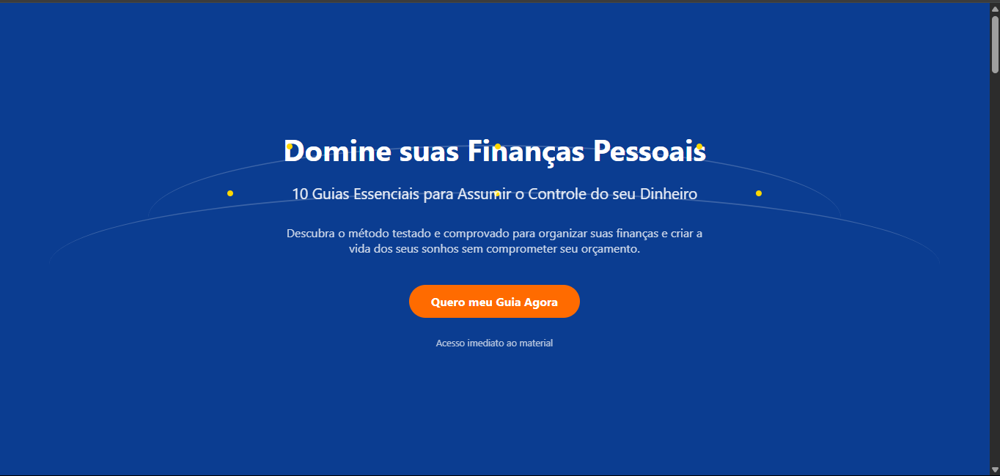

# Landing Page - Domine suas Finanças Pessoais

Uma landing page responsiva para promover um guia de finanças pessoais, com foco em converter visitantes em leads ou clientes.



## 📋 Sobre o Projeto

Este projeto consiste em uma landing page moderna e responsiva, desenvolvida para apresentar um guia completo sobre finanças pessoais. A página inclui várias seções estrategicamente organizadas para aumentar a taxa de conversão:

- **Hero Section**: Apresentação inicial do produto com chamada para ação
- **Introdução**: Benefícios principais do guia
- **Guias Essenciais**: Detalhamento dos 10 guias oferecidos
- **Depoimentos**: Feedback de usuários que utilizaram o material
- **Como Funciona**: Processo simplificado para utilização do guia
- **Bônus**: Conteúdos adicionais oferecidos
- **FAQ**: Perguntas frequentes sobre o produto
- **CTA Final**: Chamada para ação final

## 🚀 Tecnologias Utilizadas

- HTML5
- CSS3 (com variáveis CSS para facilitar a manutenção)
- JavaScript (vanilla)
- Design responsivo
- SVG para ilustrações

## 🔧 Estrutura do Projeto

```
landingPageGuia/
├── index.html         # Estrutura principal da página
├── css/
│   └── styles.css     # Estilos organizados com variáveis CSS
├── js/
│   └── script.js      # Funcionalidades JavaScript (FAQ interativo)
└── images/            # Diretório de imagens (se necessário)
```

## ✨ Principais Recursos

- **Design Moderno**: Layout contemporâneo com cores atrativas
- **Responsividade**: Adaptação para todos os tamanhos de tela
- **Elementos Visuais**: Ícones e SVGs para ilustrar conceitos
- **FAQ Interativo**: Perguntas e respostas em accordion
- **Depoimentos**: Social proof para aumentar credibilidade
- **CTA Estratégicos**: Botões de call-to-action posicionados estrategicamente

## 🎨 Paleta de Cores

O projeto utiliza uma paleta de cores consistente definida através de variáveis CSS:

- **Cor Primária**: #0b3d91 (Azul escuro)
- **Cor Secundária**: #FF6B00 (Laranja)
- **Cor de Destaque**: #FFD700 (Amarelo)
- **Cores de Fundo**: #f5f5f7 (Cinza claro)

## 💻 Como Executar

1. Clone o repositório
2. Abra o arquivo `index.html` em qualquer navegador moderno
3. Para desenvolvimento, edite os arquivos usando seu editor de código favorito

## 📝 Personalização

Para personalizar esta landing page para outro produto:

1. Edite o conteúdo no arquivo `index.html`
2. Ajuste as cores e estilos em `css/styles.css` (principalmente as variáveis CSS)
3. Modifique as funcionalidades JavaScript em `js/script.js` conforme necessário
4. Substitua ou adicione imagens na pasta `images/`

## 📱 Responsividade

A landing page foi desenvolvida seguindo o princípio de mobile-first e se adapta perfeitamente a:

- Dispositivos móveis
- Tablets
- Desktops

## 👨‍💻 Desenvolvedor

Projeto desenvolvido como atividade para o curso de Segurança da Informação do IFPI.

---

© 2025 - Todos os direitos reservados